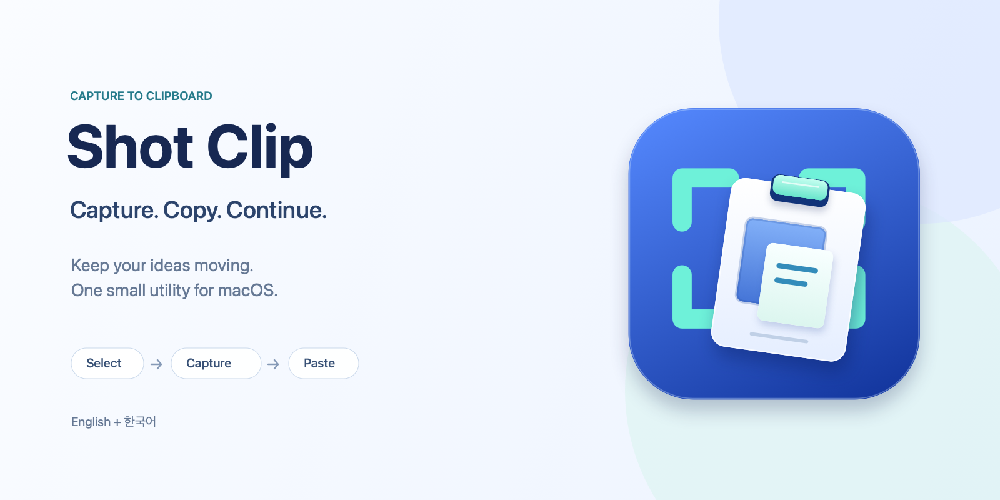

# Shot Clip

[English](README.md)

화면의 필요한 부분을 캡처하고 바로 붙여 넣으세요. Shot Clip은 macOS 메뉴 막대에서 실행되며 선택한 영역을 클립보드로 복사합니다.

**[최신 릴리스 다운로드](https://github.com/kyungseok-lee/shotclip/releases/latest)**

**macOS 14 이상과 Apple Silicon(arm64)**이 필요합니다. 현재 프리뷰는 ad-hoc 서명이며 **Apple 공증을 받지 않았습니다**.

## 설치와 캡처 권한

1. ZIP을 풀고 **Shot Clip.app**을 **응용 프로그램** 폴더로 옮긴 뒤 그곳에서 실행합니다.
2. 최초 실행이 차단되면 다운로드를 신뢰할 수 있는지 확인하고, 앱을 열어 본 뒤 **시스템 설정 → 개인정보 보호 및 보안 → 그래도 열기**가 제공되는 경우 선택합니다. [Apple의 최초 실행 안내](https://support.apple.com/ko-kr/102445)를 참고하세요.
3. 메뉴에 **화면 기록 허용…**이 표시되면 선택하고 **화면 기록 허용**을 누릅니다. macOS **화면 기록** 설정에서 Shot Clip을 허용하세요. 버전에 따라 **화면 및 시스템 오디오 기록**으로 표시됩니다. 캡처 메뉴가 이미 보이면 권한 단계를 건너뛰고 바로 캡처할 수 있습니다.
4. **설정… → 권한**으로 돌아와 **다시 확인**을 누릅니다. 여전히 권한이 적용되지 않았다면 Shot Clip을 재시작합니다.

## 캡처와 붙여 넣기

Shot Clip 메뉴에서 캡처 방식을 선택합니다.

- **영역 캡처:** 원하는 영역을 드래그하고 놓으면 캡처하여 복사합니다.
- **고정 영역:** 선택 영역을 이동하거나 핸들로 크기를 조절한 뒤 **Return** 또는 **캡처**를 누릅니다. 현재 실행 중 마지막 선택을 다시 사용하며 앱을 재시작하면 영역은 초기화됩니다.

이미지를 지원하는 앱에서 **⌘V**로 붙여 넣습니다. macOS 미리보기에서는 **⌘N**으로 클립보드 이미지를 열 수 있습니다.

기본 단축키 **⌃⇧⌘5**(Control–Shift–Command–5)는 마지막으로 사용한 캡처 방식을 엽니다. 첫 기본은 영역 캡처이며 선택한 방식과 사용자 단축키를 기억합니다. 단축키를 쓰려면 Shot Clip이 실행 중이어야 합니다. **설정… → 일반**의 **캡처 단축키** 옆에 현재 키 조합이 표시된 버튼을 누르고 새 조합을 입력하세요. Command 또는 Control과 Shift 또는 Option을 함께 사용하며 Escape로 입력을 취소합니다.

| 영역 선택 중 | 동작 |
| --- | --- |
| Escape | 기존 클립보드를 유지하고 취소 |
| Return | 선택 영역 캡처 |
| M | 영역 캡처와 고정 영역 전환 |
| 방향키 / Shift + 방향키 | 1 / 10포인트 이동 |
| Option + 방향키 | 오른쪽 위 모서리에서 크기 조절 |
| Tab / Shift + Tab | 다음 / 이전 컨트롤로 포커스 이동 |

선택 영역은 하나의 화면 안으로 제한됩니다.

## 원본 보기와 저장

복사에 성공하면 오른쪽 아래에 썸네일이 잠시 표시됩니다. 클릭하면 원본 캡처를 엽니다. **화면에 맞춤**과 **100%**는 보기 배율을 바꾸며, **저장…**은 선택한 위치에 원본을 PNG로 내보냅니다.

썸네일을 닫거나 미리보기 창을 닫거나 저장을 취소해도 클립보드는 유지됩니다. 썸네일이 사라진 뒤에도 복사한 이미지를 붙여 넣을 수 있습니다.

## 설정

메뉴 막대에서 **설정…**을 엽니다.

- **일반:** 캡처 단축키, **로그인 시 시작**, **English / 한국어**를 설정합니다. 영어가 기본이며 언어를 바꾸면 바로 적용되고 설정에서 읽던 위치를 유지합니다.
- **권한:** 화면 기록 상태를 확인하고 macOS 설정을 엽니다. **문제 해결…**에서 재시작과 실행 중인 앱 위치 확인을 할 수 있습니다.
- **업데이트:** **업데이트 확인…**을 누르거나 **자동으로 업데이트 확인**을 켭니다. 새 설치의 자동 확인은 꺼져 있으며 기존 선택은 유지합니다. 업데이트 설치에는 확인이 필요합니다.

## 문제가 생겼을 때

- **캡처 메뉴가 보이지 않음:** **화면 기록 허용…**을 선택하고 현재 실행 중인 Shot Clip을 허용합니다. 권한에서 다시 확인한 뒤 필요하면 재시작하세요.
- **업데이트 뒤 권한이 적용되지 않음:** ad-hoc 앱 교체 후 권한을 다시 허용해야 할 수 있습니다. **권한 → 문제 해결… → Finder에서 보기**로 응용 프로그램 폴더의 앱을 실행 중인지 확인하고 화면 기록을 허용한 뒤 재시작하세요.
- **단축키가 작동하지 않음:** Shot Clip이 실행 중인지 확인하세요. 다른 앱이 같은 키를 쓰면 일반의 현재 단축키 버튼을 눌러 다른 조합을 지정합니다.

## 개인정보

Shot Clip의 썸네일과 미리보기는 메모리에 유지됩니다. 캡처를 자동 저장하거나 디스크 이력으로 남기거나 업로드하지 않습니다. 저장을 선택할 때만 캡처 파일을 만듭니다. 선택을 취소하면 기존 클립보드를 보존하고 복사에 성공하면 캡처 이미지로 바꿉니다.

화면 기록 권한만 필요하며 접근성·전체 디스크 접근 권한은 필요하지 않습니다. 업데이트 확인은 GitHub에 접속해 업데이트 정보를 가져옵니다.

## 문서 안내

한국어 문서는 이 README에서 제공합니다. 자세한 사용법과 개발 문서는 영어로 관리합니다.

- [앱 사용 안내](docs/user-guide.md): 설치, 캡처 조작, 원본 보기·저장, 설정과 문제 해결
- [개발 안내](docs/development/README.md): 소스 빌드, 구조, 요구사항, QA와 배포
- [문서 목록](docs/README.md): 사용자·개발자 문서 목록
