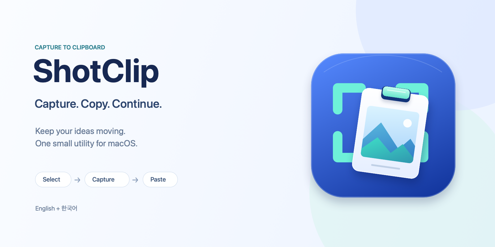

# ShotClip

[한국어](README.ko.md)



A small macOS menu bar app that captures a selected region straight to the clipboard. Select with **Fixed Region** or **Drag Region**, then paste into another app with `⌘V`.

**ShotClip 0.4.1 (build 6)** is available as a GitHub developer preview for **Apple Silicon (arm64) only**. **Ad-hoc signed; NOT notarized.** [Download the ZIP](https://github.com/kyungseok-lee/shotclip/releases/download/v0.4.1/shotclip-0.4.1.zip) or view the [v0.4.1 release](https://github.com/kyungseok-lee/shotclip/releases/tag/v0.4.1), published on 2026-10-05 02:52:28 KST from reviewed source [`24f73ed`](https://github.com/kyungseok-lee/shotclip/commit/24f73ed008028d7e957df1e485af02e65a38c25f).

This release refreshes the capture-and-clipboard icon and the project’s original brand illustrations. The artwork is synthetic and contains no captured screens. The superseded 0.4.0 GitHub release and assets were removed after the latest publication and installation checks; its source/tag history is retained.

The six public assets, signed feed and local installation/startup were verified. Capture, permission, paste, rendered language/accessibility and actual automatic upgrades remain untested; see [QA results](docs/shotclip/qa-results.md#2026-10-05-041-visual-refresh-publication-installation-and-cleanup).

## Build and run

Requires macOS 14+, Xcode with the macOS SDK, and Swift 5.9+. Build, installation and normal local startup were verified on macOS 27.0.1 / Xcode 27.0 / Apple Silicon. macOS 14 runtime is untested; the published archive contains no Intel binary.

```sh
git clone https://github.com/kyungseok-lee/shotclip.git
cd shotclip
swift test
bash scripts/build-app.sh
bash scripts/install-app.sh
open /Applications/ShotClip.app
```

For the download, unzip and place `ShotClip.app` in `/Applications`; quit ShotClip and legacy Sshot before installation. The source installer above verifies the new bundle and preserves existing installations in a backup directory that it prints. Development output is `dist/ShotClip.app`; `.build/` and `dist/` are ignored.

## Capture and language

1. Open ShotClip, then use the menu bar or `⌃⇧⌘5` (configurable) to open the last selection mode.
2. Grant **Screen Recording** when you choose to capture. Return to ShotClip and check again; restart if needed.
3. Move/resize Fixed Region and press Return or Capture. In Drag Region, release a valid drag to capture.
4. Paste with `⌘V` in an image-capable app; Preview can open the clipboard image with `⌘N`.

Escape cancels. Arrows move the region; Shift increases the step; Option+Arrows resizes its upper-right corner. `M` switches modes and Tab/Shift-Tab moves control focus. English is the default; choose **English / 한국어** in General settings and restart to apply.

Each selection stays within one display. Fixed Region is remembered only during the current session; mode and shortcut preferences persist. ShotClip must be running for the global shortcut to work. Login start is opt-in. No Accessibility or Full Disk Access permission is required.

The new `dev.shotclip.app` identity needs a fresh Screen Recording grant, even if historical Sshot was allowed. Use `/Applications/ShotClip.app` consistently. Ad-hoc replacements may need reapproval; the app shows its current location in permission recovery. It does not reset TCC. See [Apple’s permission guide](https://support.apple.com/guide/mac-help/control-access-screen-system-audio-recording-mchld6aa7d23/mac).

## Developer preview and updates

An ad-hoc preview may be blocked at first launch. After checking its source, follow Apple’s per-app **Privacy & Security → Open Anyway** flow when available; do not disable Gatekeeper globally. Ed25519 update signatures verify feed/archive integrity and do not replace Apple notarization or grant Screen Recording. See [Apple’s first-launch guidance](https://support.apple.com/en-us/102445) and [update operations](docs/shotclip/update-operations.md).

Sparkle automatic checks are opt-in and **OFF by default**. The [public signed feed](https://github.com/kyungseok-lee/shotclip/releases/latest/download/appcast.xml) and release archive were verified on 2026-10-05. Updates retain the existing Ed25519 key and Keychain account `sshot`, with no key rotation, export or regeneration. Moving from historical Sshot requires a one-time manual ShotClip install; selected shortcut/mode settings migrate, permission and login registration do not. A same-ID automatic upgrade to a newer ShotClip build has not been tested.

## Privacy and verification

Capture/encode happens in memory; ShotClip adds no cloud, capture history, storage, or OCR. It does not log captured images, screen content, app/window information, or clipboard contents. Cancellation, denial, and capture/encoding failure leave the clipboard unchanged. Clipboard write recovery has OS atomicity limits; failures are reported.

Fast checks and user-owned capture steps are in the [QA plan](docs/shotclip/qa-plan.md). Capture GUI/permission/paste checks have **not** been passed by this documentation work. The opt-in harness uses synthetic content and a unique named pasteboard; SKIP is not PASS.

Read the [product plan](docs/shotclip/product-plan.md), [development plan](docs/shotclip/development-plan.md), [design system](docs/shotclip/design-system.md), and [handoff](docs/shotclip/handoff.md), or browse the [documentation index](docs/shotclip/README.md).
